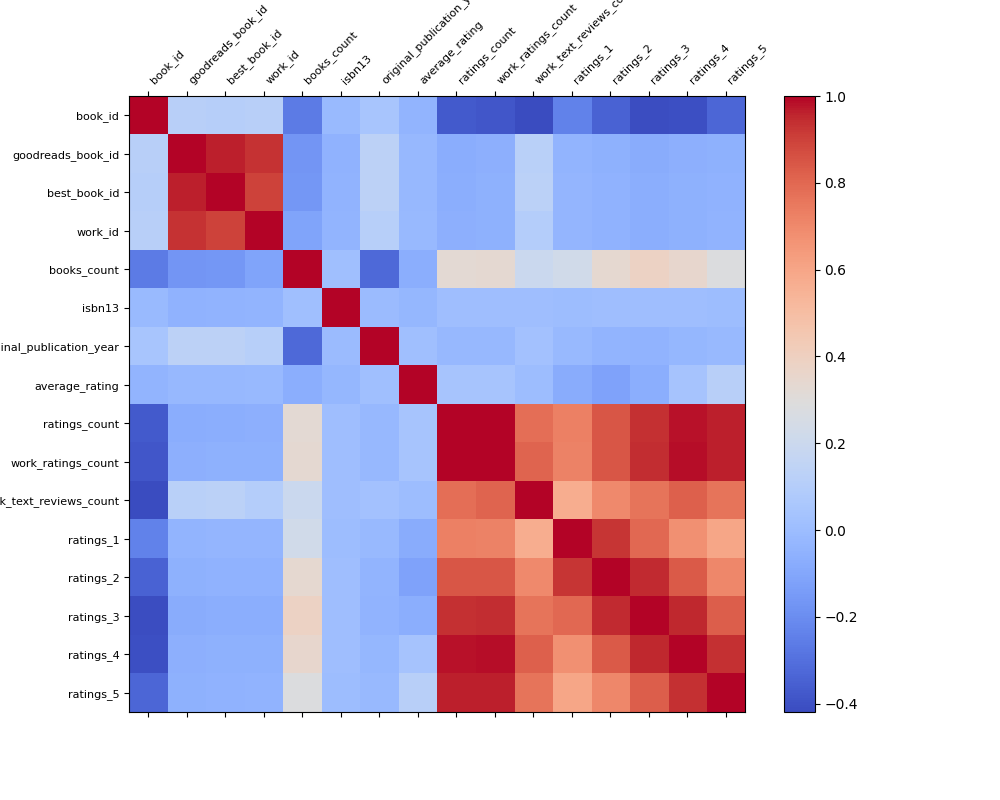

# Automated Data Analysis Report

# Dataset Overview

This dataset presents a collection of information about books from a reading platform, likely Goodreads, based on the various identifiers and statistics available. It contains 10,000 entries and encompasses a wide array of attributes related to book metadata, including details about authors, publication years, and various ratings from users.

## Column Names and Descriptions
1. **book_id**: Unique identifier for each book.
2. **goodreads_book_id**: Unique identifier specific to Goodreads.
3. **best_book_id**: Identifier for the best version of a book.
4. **work_id**: Identifier for the overall work which may include different editions.
5. **books_count**: Number of editions or formats available for the book.
6. **isbn**: Standard book number (some missing values).
7. **isbn13**: 13-digit standard book number, with some entries missing.
8. **authors**: List of authors for each book.
9. **original_publication_year**: Year the book was originally published.
10. **original_title**: The title under which the book was originally published.
11. **title**: The current title of the book.
12. **language_code**: Language in which the book is written.
13. **average_rating**: Average rating given to the book by readers.
14. **ratings_count**: Total number of ratings received by the book.
15. **work_ratings_count**: Total ratings for the work, which could include multiple editions.
16. **work_text_reviews_count**: Number of written reviews for the work.
17. **ratings_1 to ratings_5**: Counts of ratings categorized from 1 star to 5 stars.
18. **image_url**: URL for the book's cover image.
19. **small_image_url**: URL for a smaller version of the book's cover image.

## Key Insights

1. **Missing Data**:
   - The dataset contains a significant amount of missing data for `isbn` (700 entries), `isbn13` (585 entries), `original_publication_year` (21 entries), `original_title` (585 entries), and `language_code` (1084 entries). This missing data, especially for ISBN numbers and publication years, could impact the ability to cross-reference and accurately assess the books.

2. **Popular Authors**:
   - The most frequently mentioned author is **Stephen King**, appearing in 60 entries of the dataset, indicating a strong presence of his works within the dataset. This could imply the need for greater focus on popular authors when curating recommendations or analyses.

3. **Publication Trends**:
   - The average original publication year is approximately **1982**, with a maximum value of **2017**. This suggests a significant number of books catered to historical contexts and also some newer titles, indicating a diverse range of literature.

4. **Ratings Analysis**:
   - The average rating across all books is about **4.00**, which indicates a generally positive reception among readers. The ratings distribution reveals a predominance of high ratings, with a combined average of ratings over 4 stars being significantly higher than lower ratings. However, the standard deviations indicate variability in how different books are perceived.

5. **Language Distribution**:
   - English is the dominant language among the entries, occurring in **6341** records. However, there is diversity with **25 unique languages** indicated, highlighting a broad appeal and availability of books in multiple languages.

## Recommendations

1. **Data Cleaning and Imputation**:
   - Consider implementing data cleaning strategies for the missing values in `isbn`, `isbn13`, `original_publication_year`, and `language_code`. Methods like imputation or sourcing missing data from reliable databases could improve data quality.

2. **Focus on Popular Genres/Audiences**:
   - Leverage insights on popular authors (e.g., Stephen King) and genres to curate targeted recommendations or promotional efforts. Understanding audience interests through the dataset ratings could enhance user engagement.

3. **Trend Analysis Over Time**:
   - Additional analysis could be conducted to examine trends in publication years versus average ratings. This may help identify if historical contexts are less favored compared to contemporary works.

4. **Multilingual Recommendations**:
   - With a variety of languages present in the dataset, consider developing promotional initiatives targeting multilingual audiences, thereby increasing inclusivity and market reach.

5. **Further Exploration on Ratings**:
   - Investigate the distribution of ratings further to identify potential bias in reviews and understand preferences among different demographics (if demographic data is available) to optimize book selections for marketing campaigns.

By following these actionable steps and leveraging the insights gained, stakeholders can enhance the overall experience for users and bolster the effectiveness of marketing strategies associated with the books in this dataset.

## Visualizations

