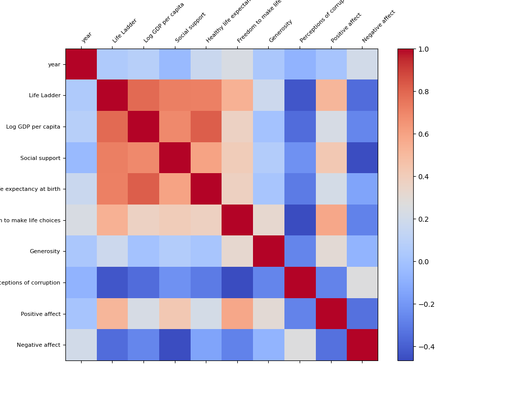

# Automated Data Analysis Report

# README.md

## Dataset Description

This dataset encompasses a wealth of information related to subjective well-being and various socio-economic indicators across 165 countries from the years 2005 to 2023. It includes several metrics that provide insight into factors influencing happiness and quality of life. The columns within the dataset are as follows:

- **Country name**: The name of the country.
- **Year**: The year the data was recorded.
- **Life Ladder**: A measure reflecting citizens' subjective well-being, where higher values represent greater life satisfaction.
- **Log GDP per capita**: The natural logarithm of the GDP per capita, which serves as an indicator of economic prosperity in relation to population size.
- **Social support**: A reflection of the perceived availability of support from family and friends.
- **Healthy life expectancy at birth**: The average number of years a person can expect to live in good health, based on current mortality rates.
- **Freedom to make life choices**: An index measuring personal freedom and individual autonomy.
- **Generosity**: A measure of altruistic behaviors, indicating how willing individuals are to contribute to charitable activities.
- **Perceptions of corruption**: A measure indicating how corruption is perceived in society.
- **Positive affect**: The extent to which individuals experience positive emotions.
- **Negative affect**: The extent to which individuals experience negative emotions.

## Key Insights

Based on the analysis of the dataset, several noteworthy insights emerge:

1. **Life Satisfaction Trends**:
   - The average 'Life Ladder' score across all observations is approximately 5.48, indicating a moderate level of life satisfaction globally. The scores range significantly, from a low of 1.281 to a high of 8.019.

2. **Economic Influence**:
   - Log GDP per capita shows a strong correlation with 'Life Ladder' scores. Countries with a higher GDP per capita tend to report higher life satisfaction levels, suggesting economic prosperity is a significant factor for well-being.

3. **Social Support**:
   - The average score for 'Social support' is around 0.809, illustrating its importance in enhancing life satisfaction. Regions with strong community ties and family networks generally see higher 'Life Ladder' scores.

4. **Health and Longevity**:
   - The mean 'Healthy life expectancy at birth' is 63.4 years, with significant variations across countries, highlighting discrepancies in health outcomes. Healthier populations report higher satisfaction, emphasizing the role of healthcare access and quality.

5. **Freedom and Autonomy**:
   - The data shows an average score of 0.75 for 'Freedom to make life choices', with increased freedom correlating positively to life satisfaction. Countries known for high levels of individual freedom tend to exhibit better well-being metrics.

6. **Emotional Well-Being**:
   - The average for 'Positive affect' (0.652) is notably higher than that for 'Negative affect' (0.273), indicating a general propensity for positive emotions over negative. Nonetheless, the presence of negative emotions should not be overlooked, as they can impact overall life satisfaction.

## Actionable Recommendations

Based on the insights drawn from the dataset, the following steps are recommended:

1. **Policy Focus on Economic Growth**: Governments should emphasize economic policies that stimulate growth, particularly in lower-GDP countries. Investment in education and job creation can lead to elevated 'Life Ladder' scores.

2. **Enhance Social Support Structures**: Develop community programs that strengthen social networks and support systems. Initiatives that foster community engagement can positively influence both social support and life satisfaction.

3. **Healthcare Accessibility**: There should be a concerted effort to enhance healthcare access, particularly in countries with low 'Healthy life expectancy'. Programs aimed at improving nutrition, preventative care, and health literacy will be beneficial.

4. **Promote Individual Freedoms**: Encourage policies that protect and enhance personal freedoms and choices, thereby contributing to a stronger sense of agency among citizens.

5. **Mental Well-Being Programs**: Implement and promote mental wellness programs to address both positive and negative emotional states. Given the measurable effects on life satisfaction, these initiatives should be an integral part of public health strategies.

6. **Continued Data Monitoring**: Conduct ongoing research and data collection to monitor trends in life satisfaction and its determinants. Making data accessible to policymakers will guide effective interventions.

By taking a data-driven approach to enhancing quality of life across various dimensions, countries can create environments where citizens achieve higher levels of well-being and satisfaction.

## Visualizations

