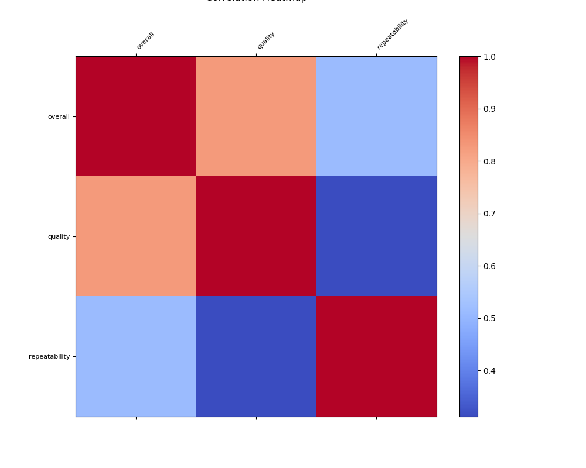

# Automated Data Analysis Report

# README.md

## Dataset Overview

This dataset contains information regarding reviews of various media items (likely movies and shows) collected over time. The dataset includes the following columns:

- **date**: The date when the review was recorded.
- **language**: Language of the media being reviewed.
- **type**: The type of media, e.g., movie, series.
- **title**: The title of the media item reviewed.
- **by**: The reviewer’s name or identifier.
- **overall**: The overall rating given by the reviewer, on a scale of 1 to 5.
- **quality**: Rating specifically reflecting the quality of the media, also on a scale of 1 to 5.
- **repeatability**: A rating indicating the likelihood of the reviewer recommending the media for repeated viewing, on a scale of 1 to 3.

The dataset contains 2652 records, with 8 unique types of media, reviewed in 11 different languages. It shows a variety of titles as well as the authorship of reviews. However, there are missing values, particularly in the 'date' (99 missing) and 'by' (262 missing) columns.

## Summary of Key Insights

1. **Date Distribution**: The dataset records reviews spanning many dates, with the most frequent date being '21-May-06' which appears 8 times. However, there is a significant amount of missing data in this column that needs addressing for temporal analysis.
  
2. **Language Analysis**: The majority of reviews are in English (1306 entries), which constitutes nearly 49% of the dataset. This indicates a strong preference or availability of content in English compared to other languages.

3. **Media Type Popularity**: Out of the unique types present, 'movie' is the most common with 2211 entries (over 83% of the dataset), suggesting a focus on films. Exploring user reviews for other types may reveal interest in additional content types.

4. **Rating Insights**:
   - The average **overall rating** is approximately 3.05, which suggests a generally positive reception of the media, though there is room for improvement.
   - The **quality rating** averages around 3.21, further indicating that while the media is perceived positively, there are mixed feelings regarding quality.
   - The average **repeatability rating** is 1.49, suggesting that most reviewers do not highly recommend these titles for re-watching or revisiting.

5. **Reviewer Engagement**: There are 1528 unique reviewers, but 262 entries lack a reviewer's identifier, indicating the necessity to improve user engagement tracking.

## Actionable Recommendations

1. **Data Cleaning**: Address the missing values, particularly in the **date** and **by** columns. Filling these gaps will facilitate better data analysis and visualization. Consider removing entries that lack essential information or imputing missing values where feasible.

2. **Focus on Language Diversification**: With a significant number of English reviews, explore content in other languages to assess user ratings and feedback. This could elucidate markets for content expansion.

3. **Quality Improvement Strategy**: Given the average ratings below 4 for both overall and quality, further investigation into the common factors for lower ratings may yield insights for enhancing content quality and user satisfaction.

4. **Engagement Initiatives**: Implement measures to encourage user engagement and gather reviews. This can include incentives for leaving feedback and reminders for users who have watched the media.

5. **Temporal Analysis**: Conduct an analysis of how ratings have evolved over time to understand trends and changes in viewer perceptions of media quality.

By acting on these recommendations, stakeholders can enhance user experience, improve content quality, and develop better strategies for content presentation and marketing.

## Visualizations

